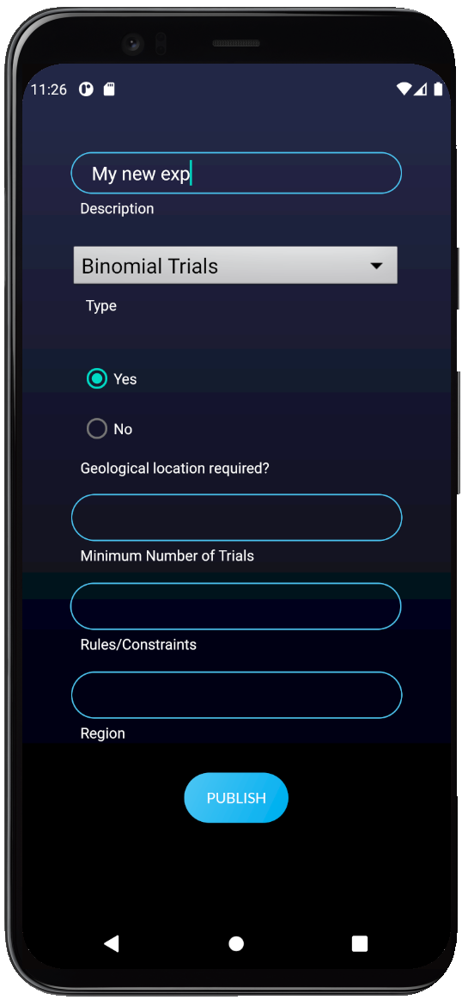
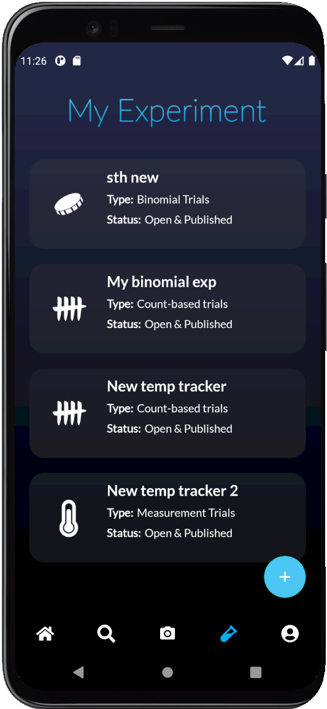
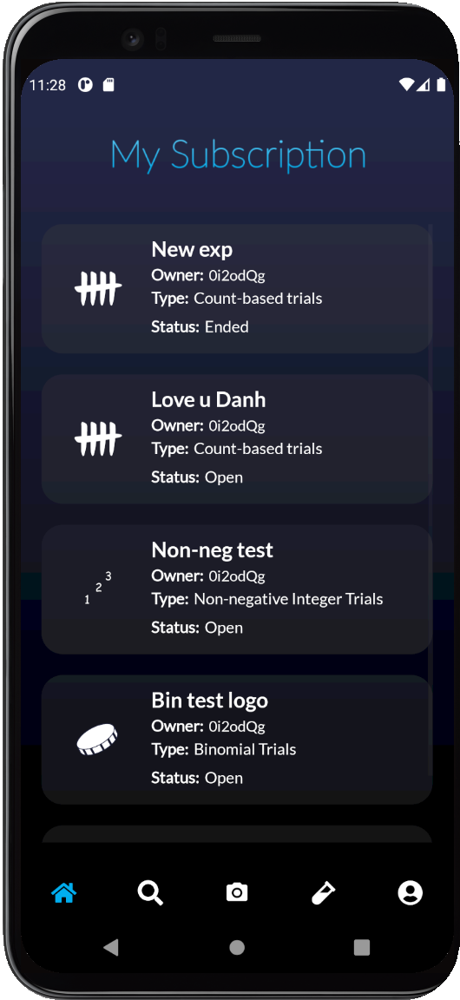
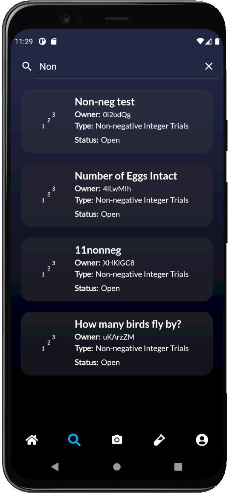
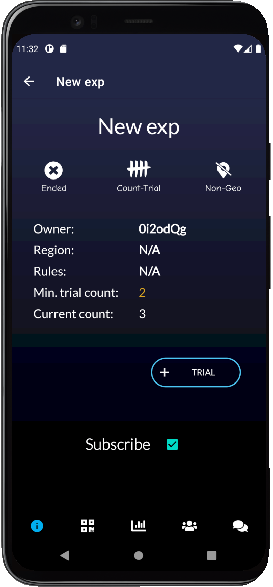

<h1 align="center">Appraisal</h1>
<h3 align="center"><i>A complete tracking and statistic tool</i></h3>

    

<h3>1. Introduction</h3>

    <i>Appraisal</i> is an experiment tracking tool with in-depth analysis. Experiment result are visible to all among users
    by default, allowing all users to discuss and track experiments of one another.

<h3>2. Instruction</h3>

<h4>My Experiments</h4>

Create and manage your experiments

    
    

<h4>Search and Subscribe</h4>

    
    

<h4>In-depth look</h4>

Details, analysis, discussion, and many more!

    
    

<h3>3. Acknowledgement</h3>

    Source code used and implement codes and/or code snippets from resources such as StackOverflow, Android Developer,
    and Lectures/Labs' materials of course CMPUT301, University of Alberta W21, and more.   Source and citation can be found
    <a href="https://github.com/CMPUT301W21T11/Appraisal/wiki/Code-Attribution">here</a>. 

<h3>4. License</h3>
